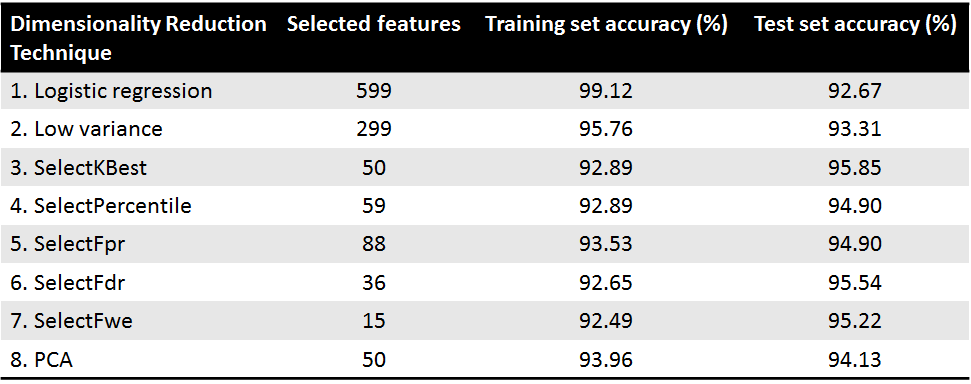

# Dimensionality Reduction on Semiconductor Dataset

### Introduction

In this project, a semiconductor manufacturing dataset has been studied and analyzed. 
Modern semiconductor manufacturing is a complex and evolved process. Semiconductor wafers undergo various processing tools where their electrical and physical characteristics are altered. At each stage, vast number of signals are collected and analyzed. However, not all signals are equally valuable. The information obtained from these collected signals contain useful information as well as noise. Thus, dimensionality reduction techniques such as feature selection and feature extraction can be applied to obtain most relevant features. This project is aimed at exploring and comparing the following techniques:

####Feature Selection Techniques
1. Random Forest Classifier
1. Extra Trees Classifier
1. Low Variance
1. Univariate feature Selection
	1. SelectKBest
	1. SelectPercentile
	1. SelectFpr
	1. SelectFdr
	1. SelectFwe
1. L1 based feature selection
	1. SelectFromModel and LogisticRegression
	1. SelectFromModel and LinearSVC

#### Feature Extraction Technique
Principal Component Analysis

#### Dataset

Dataset used for this project is SECOM semiconductor manufacturing dataset from UCI machine learning repository. (http://archive.ics.uci.edu/ml/datasets/secom). SECOM dataset is a classification dataset with 1567 samples and 591 attributes (590 variables and 1 class variable).

#### Technical requirement

This project is developed in Python using Scikit learn machine learning library. In order to run this code onto your system, you need to have Python and Scikit learn package installed onto your system. You can use any Python IDE. I found Spyder (python IDE) really helpful for visualizing data frames and variables. 

#### Feature selection techniques

1. **Removing features with low variance**: In this approach features whose variance is below a certain predefined threshold are removed. The variance of variables can be calculated by the formula: Var[x] = p (1 - p).

2. **Univariate feature selection**: In this approach features are selected based on univariate statistical test. It is considered as a processing step to an estimator. 

3. **L1 based feature selection**: L1 based feature selection is useful for sparse dataset. This approach is used as a sparse estimator to select non-zero coefficients.

4. **Feature selection using Random Forest**: This approach can be used to compute feature importance based on which it can be decided which features to be kept and which to be discarded for designing our classification model.

#### Feature extraction technique
**Principal Component Analysis (PCA)**: 
PCA is a feature extraction technique that uses orthogonal transformation to convert set of correlated features into linearly unrelated features called principal components.

#### Comparative analysis

1. Base case accuracy for SECOM dataset using logistic regression classifier: Training - 99.12%, Testing - 92.67%.
2. It can be seen clearly that the accuracy of training set is higher than test set. This indicates that our model is overfitting the training data and it fails to generalize well on unseen data. Thus, applying dimensionality reduction techniques would help to reduce the noise from training data and thus improving model performance on test set.
3. Following table shows performance of different dimensionality reduction techniques on SECOM datasets.

From the above table, it can be concluded that, after applying various feature selection techniques like low variance, univariate feature selection and L1 based feature selection as a preprocessing step, performance of classifier has improved. However, the best performance is achieved by applying PCA with 50 transformed features.
 

